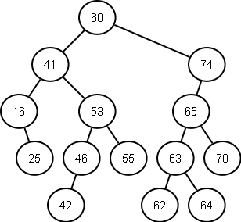
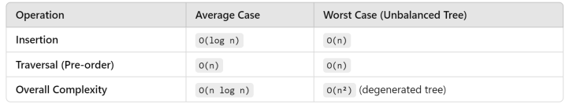
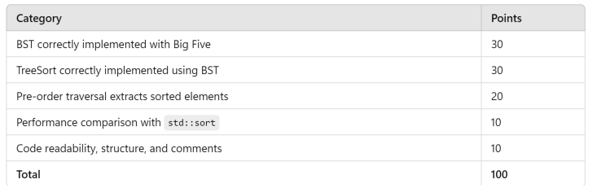

# CS-304-BST
This is Assignment 4 of Data Structure. Which requires us to create a BST or a Binary Search Tree. 
Like so : 

The tree works by putting new nodes either on the right or left of the root ( if there isnt a root make it the root ), so if it is bigger make the node connect on the right if it is smaller on the left.

## Table of contents
- [The Goal](#the-goal)
    - [What to implement](#what-to-implement)
        - [Bonus](#bonus)
- [Time Complexity](#time-complexity)
    - [Comparison](#comparison-of-the-two-times)
        - [ TreeSort](#treesort)
        - [ std::sor()](#cs-stdsort)
    - [Quick resume](#quick-conclusion)
- [Grading](#grading)
- [Files](#the-actual-file)

# The Goal
The goal is to make a Binary search tree that will sort a given array called BST. This tree should have a preOrder and Inorder that will output a vector of the traversal. The tree sort should then be compared to the normal std::sort.

## What to implement 
1. The big 5 ( destructor, copy constructor/assignment and move constructor/assignment )
2. Insert function
3. PreOrder Traversal
4. InOrder Traversal ( for in order vector return )
5. have a remove function
6. Compare the performance of both normal sorting and TreeSort

Note : I also made it so it prints the tree

###     Bonus
- Bonus 1 : Use stack for array's that have repeating numbers.
- Bonus 2 : Use a self Balancing tree .

# Time Complexity 

Here is a quick pixaleted tables of the time complexit difference

## Comparison of the two Times 
> The following are numbers are **__VERY DEPENDENT__** of your machine
###     TreeSort 
TreeSort is normally __**O**(n(log(n)))__ as previously showned.\
Here are some example results of timing given by the program previously ( Note that these values will be different depending on the machine ):\
Excluding the input of numbers into the tree : 
| run # | Time (μs) |
| ----- | --------- |
|   1   | 216       |
|   2   | 146       |
|   3   | 140       |

These values should normally stay around 150 and up to 220 in some cases.

Including the adding of numbers: 
| run # | Time (μs) |
| ----- | --------- |
|   1   | 1445      |
|   2   | 1487      |
|   3   | 1466      |

These values roam around 1400 to 1600 in some cases;

###     c++'s std::sort
Std::Sort should be __**O**(n(log(n)))__ much like TreeSort thus we would expect them to have similar outcomes in time.\
Here are some results to show this : 
| run # | Time (μs) |
| ----- | --------- |
|   1   | 1062      |
|   2   | 1057      |
|   3   | 1078      |

These values stay around 1000 to 1500 in some cases.

## Quick Conclusion
As we cann see the tree sort is marginally faster but it requires it to a already be a tree, if we add the input we can get values similar to sort. So if you work with a numbers that need to be sorted at some point and dont need to be an array or a vector it would be much faster to simply use a tree in the other case where you need it to act like an array tree sort is not as since treesort will require to make a tree and then traverse it which is slightly slower then just std::sort().

# Grading

and the grading

# The actual file 
Here is the file about the Assignment : [Click here for link !](Documents/CS304_A4_treesort.pdf)

> Note: there is a problem with it as it says that you can sort with a preorder but you cannot, other then that there is some problem but it's not that bad.
